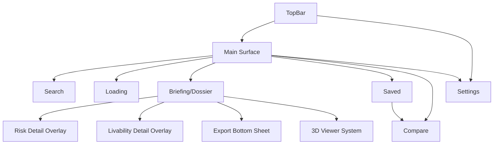
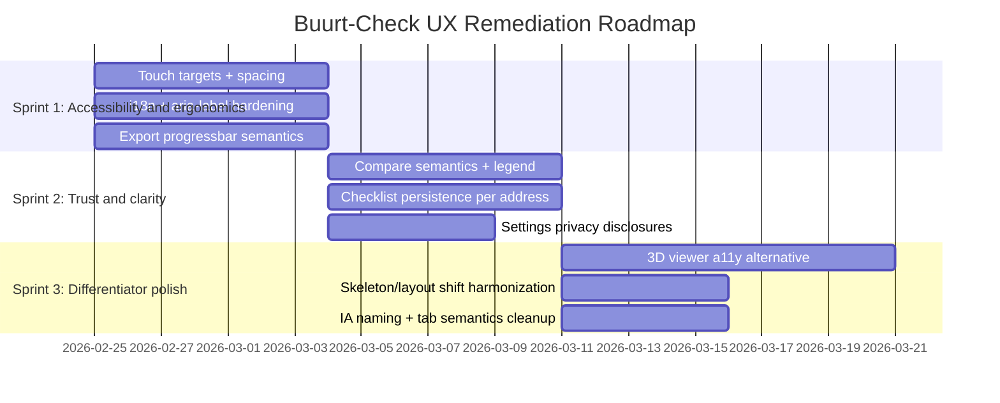

# Buurt-Check UX Assessment

**Download this report (Markdown):** [buurt-check-ux-assessment-2026-02-24.md](sandbox:/mnt/data/buurt-check-ux-assessment-2026-02-24.md)

**Audit target:** `milos-agathon/buurt-check` repository on entity["company","GitHub","code hosting platform"], assessed on **2026-02-24** (Europe/Amsterdam).  
**Standards baseline:** entity["organization","Nielsen Norman Group","ux research firm"] heuristics by entity["people","Jakob Nielsen","usability expert"] (Nielsen’s 10). citeturn4view0 WCAG 2.1 AA per entity["organization","W3C","web standards body"]. citeturn1search1turn1search0 Mobile touch target guidance from entity["company","Apple","consumer electronics company"] and entity["company","Google","technology company"] (Material). citeturn2search2turn0search0

## Executive summary

Buurt-Check already demonstrates several “high maturity” UX moves that many teams only add late: progressive narrative loading (house → risk → buurt), data coverage and recency transparency, per-section retry logic, and a dedicated loading screen with reduced-motion support. Those align strongly with Nielsen’s “visibility of system status” and with the product promise (“trust UI” in a high-stakes decision). citeturn4view0

The most material UX debt is now concentrated in a small number of seams that directly affect conversion, accessibility, and perceived polish on real phones:

| Priority theme | Why it matters for a multi-million-dollar app | What to do first |
|---|---|---|
| Touch targets below platform guidance | Smaller hit targets measurably increase errors, frustration, and drop-off; also raises accessibility risk | Normalize to ≥44pt (Apple) / ~48dp (Material) for all tappables, including segmented controls and pills citeturn2search2turn0search0 |
| Bilingual accessibility gaps | Hardcoded English in aria-labels and relative time strings harms Dutch-first and assistive-tech users | Replace hardcoded strings with i18n keys; add CI guardrail for aria-label localization |
| IA ambiguity (“Home” vs “Briefing”) | When two tabs lead to the same surface, predictability drops and narrative becomes harder to learn | Make “Home” always be Search (or explicitly a “Continue” state); update naming and behavior |
| Risk comprehension semantics | Users must quickly interpret “this address vs benchmark”; unclear chart semantics threatens trust | Differentiate benchmark rows visually and textually; add legends and “directionality” cues |
| Affordance honesty (sheet grab handle) | Non-functional affordances read as “prototype,” undermining trust | Implement snap/drag or remove the handle styling and cursor/promise |
| Persistence of actionability | If checklist state disappears, users won’t rely on it at a viewing | Persist checklist per address; allow “Reset” and explain local storage |

## Assumptions and constraints

**Tooling and access**

The GitHub connector does not expose a complete directory tree listing in one operation. The inventory and assessment were reconstructed from reachable imports and code-search results, then validated against the attached prior appraisal (`/mnt/data/2026-02-23-ux-appraisal.md`). This means:

- High confidence for *reachable runtime UI* (what App.tsx actually imports and renders).
- Moderate risk of missing dormant/unreferenced components or assets not keyed in texts.

**Attached document scope assumptions**

The attached document appears to be a prioritized UX appraisal dated 2026-02-23 with both confirmations and “stale” items. I assume it contains prior findings across: touch targets, bilingual issues, IA ambiguity, risk duplication, checklist persistence, compare semantics, export feedback, and dossier affordances.

Cross-checking outcome (high level):

- Several previously reported issues appear **resolved** in the current code path (notably: hash routing, progressive loading, loading screen, and shortlist reopen wiring).
- Several issues appear **still present** (notably: touch target sizing in header controls, and hardcoded English for some labels/time outputs).
- Items that require *rendered visual verification* are flagged as “needs runtime verification.”

**Definition of “every part” in this report**

Within the constraints above, “every part” is interpreted as: all screens, overlays, flows, and UI component systems identifiable from imports and repo docs; plus the UX-impacting backend behaviors and the design token system.

## Repository inventory and system architecture

**Catalog of screens, components, flows, and assets**

| Item | Type | Primary file(s) | UX role / notes |
|---|---|---|---|
| App shell and orchestration | screen controller | `frontend/src/App.tsx`, `frontend/src/App.css` | Hash routing, progressive loading phases, retry patterns, and long-form dossier narrative. |
| Search | screen | `frontend/src/components/AddressSearch.tsx` (+ CSS) | Entry point: suggestions, recents, empty-state value props. |
| Loading screen | screen/flow | `frontend/src/components/LoadingScreen.tsx` (+ CSS) | Staged progress and delight; reduced-motion supported. |
| Top bar | global component | `frontend/src/components/TopBar.tsx` (+ CSS) | Title/brand and language toggle; settings icon. |
| Tab bar | global component | `frontend/src/components/TabBar.tsx` (+ CSS) | Primary navigation: Home/Briefing/Saved. |
| Dossier wrapper | component | `frontend/src/components/DossierSheet.tsx` (+ CSS) | Sheet-like container with handle affordance. |
| Dossier jump navigation | feature | `frontend/src/App.tsx`, `frontend/src/App.css` | Sticky jump-to-house/buurt/checklist/top nav after scroll threshold. |
| Address header | component | `frontend/src/components/AddressHeader.tsx` (+ CSS) | Address identity, secondary facts, bookmark button. |
| Attention summary | component | `frontend/src/components/AttentionSummary.tsx` | “What matters” hook (needs affordance decisions). |
| 2D footprint map | component | `frontend/src/components/BuildingFootprintMap.tsx` | Basic spatial grounding. |
| Summary strip | component | `frontend/src/components/SummaryStrip.tsx` (+ CSS) | Compact risk pills and jump affordance. |
| Building facts | component | `frontend/src/components/BuildingFactsCard.tsx` (+ CSS) | Structured property facts (dl/dt/dd). |
| Risk tile system | component system | `RiskTilesGrid.tsx`, `RiskTile.tsx`, `RiskTileSkeleton.tsx` (+ CSS) | Summary + navigation to detail. |
| Risk briefing cards | component system | `frontend/src/components/RiskCardsPanel.tsx` (+ CSS) | Narrative cards with meaning, metric, question, source. |
| Risk detail | overlay screen | `frontend/src/components/RiskDetailView.tsx` (+ CSS) | Modal detail with comparisons and checklist toggles. |
| Warnings + soil | components | `PropertyWarningsCard.tsx`, `SoilInfoCard.tsx` | Localized risk/purchase friction signals. |
| Livability | component + overlay | `LivabilityCard.tsx`, `LivabilityDetailView.tsx` | Neighborhood livability and detail modal. |
| 3D neighborhood experience | component system | `NeighborhoodViewer3D.tsx`, `ShadowTimeSlider.tsx`, `SunlightRiskCard.tsx`, `ShadowSnapshots.tsx` | Differentiator and perceived value engine. |
| Neighborhood stats + Tier B | components | `NeighborhoodStatsCard.tsx`, `TierBSignalsCard.tsx` | Secondary, contextual signals. |
| Viewing checklist | component | `ViewingChecklist.tsx` | Actionability: bring-to-viewing. |
| Action bar | fixed CTA | `ActionBar.tsx` (+ CSS) | Save + export CTAs. |
| Export sheet | overlay flow | `ExportBottomSheet.tsx` (+ CSS) | Template/language selection, progress, share/download. |
| Saved / shortlist | screen | `ShortlistScreen.tsx` | Retention loop and compare launch. |
| Compare | screen | `CompareScreen.tsx` (+ CSS) | Side-by-side compare; includes charting primitive. |
| Settings | screen | `SettingsScreen.tsx` | Theme + “clear local data” controls. |
| Toasts | system UI | `frontend/src/components/ui/Toast.tsx` | Immediate feedback loops. |
| Bottom sheet primitive | reusable | `frontend/src/components/ui/BottomSheet.tsx` | Modal/dismiss patterns and focus management. |
| Tokens and typography | styling system | `frontend/src/styles/tokens.css`, `frontend/src/styles/satoshi.css` | Global palette, spacing, type; controls contrast posture. |
| App identity assets | assets | `frontend/public/logos/*`, `frontend/public/manifest.json`, `frontend/index.html` | PWA name, icons, theme color, brand lockups. |
| Backend API surface | UX-critical service | `backend/app/main.py`, `backend/app/api/*`, `backend/app/config.py` | Failure/latency cascades into client UX; affects trust. |
| Testing and QA harness | QA | `frontend/package.json`, tests under `frontend/src/*` | a11y, keyboard and performance tests exist per scripts. |

**IA and surface map (proxy)**



## Screen, flow, and component assessments

Each item below is assessed against: description; Nielsen + mobile heuristics; WCAG 2.1 AA + mobile accessibility; performance UX; security/privacy UX; i18n; visual design; interaction/motion; data-entry; onboarding; error/empty states; analytics; and prioritized fixes with effort/impact.

**Flow: Search → Address select → Progressive load → Dossier narrative**

| Dimension | Assessment |
|---|---|
| Description | Core journey that must feel fast, trustworthy, and predictable. It is the “first 30 seconds” conversion moment. |
| Heuristics | Aligns well with “visibility of system status,” “match to real world,” and “recognition over recall” when progressive steps and narrative ordering match user intent. citeturn4view0 |
| Accessibility | Must not rely on animation alone; step changes should be announced politely and not spam. WCAG requires meaningful status messages be accessible. citeturn1search3 |
| Performance/technical UX | Progressive phases improve perceived performance; must ensure phase transitions don’t produce layout-jank or main-thread stalls. |
| Security/privacy UX | Selecting an address is sensitive; users need a clear understanding of what is stored locally vs sent to server. |
| i18n | Bilingual support must be complete *on first contact*; any English leak reduces credibility in NL context. |
| Visual design | Narrative separation (house vs buurt) is strong; needs consistent chapter markers and scroll orientation cues. |
| Interaction/motion | Reduced motion should still preserve “step” feedback and transitions. |
| Data-entry | Input hints (postcode + house number) can improve success rate and speed. |
| Onboarding | The search surface must set expectations: what you’ll get, how long it takes, what data sources are used. |
| Error/empty states | Must recover gracefully from partial API failures without forcing re-entry. |
| Analytics | Track time-to-house, time-to-risk, time-to-buurt, and “drop before dossier.” |
| Fixes (effort/impact) | P0: localize status, labels, and errors completely (Low/High). P0: ensure hit targets meet guidance (Low/High). P1: add “what’s included” and “data sources” explanation (Med/High). |

**Screen: AddressSearch (Search)**

| Dimension | Assessment |
|---|---|
| Description | Single input with suggestions; recents; first-run value props. |
| Heuristics | Good “recognition vs recall” via recents; “visibility” weaker without explicit “searching” state. citeturn4view0 |
| Accessibility | listbox semantics exist but should add `aria-activedescendant` and `aria-controls`; ensure keyboard selection announces active option; ensure focus styles. |
| Performance | Debounce + abort controller are strong; consider caching last N queries in memory for fast backspacing. |
| Security/privacy UX | Recent searches in local storage: needs disclosure and clear delete. |
| i18n | Relative time strings (“just now”, “m ago”) are hardcoded English (cross-checked vs attached appraisal); must be localized. |
| Visual design | Clean, task-first; value prop block helps explain concept and reduces blankness. |
| Interaction/motion | Dropdown closes on outside click; for touch, improve “tap outside” reliability and avoid accidental selection. |
| Data-entry | Add `inputmode`, examples, and “postcode + house number” guidance to reduce failed queries. |
| Onboarding | Value props should include a “why trust this” line (source transparency) and time expectancy (<10s). |
| Error/empty states | Provide constructive “try this format” microcopy and preserve query. |
| Analytics | `search_query_changed`, `suggestions_shown`, `suggestion_selected`, `recent_selected`, `search_error`, `search_no_results`. |
| Fixes (effort/impact) | P0: localize relative times + aria labels (Low/High). P1: add searching indicator + aria-live (Low/Med). P1: input hints and formatting (Low/Med). |

**Screen: LoadingScreen**

| Dimension | Assessment |
|---|---|
| Description | Staged progress with animated building outline; progressbar semantics present; reduced-motion supported. |
| Heuristics | Strong “visibility of system status,” “aesthetic minimalist design,” and trust-building feedback. citeturn4view0 |
| Accessibility | Good `aria-live` and determinate progressbar semantics; reduced motion handled. |
| Performance | SVG animation is cheap; ensure no reflow loops. |
| Security/privacy UX | N/A. |
| i18n | Ensure all step keys exist in both languages. |
| Visual design | Hard-coded white background risks dark-mode breakage; should use tokens. |
| Interaction/motion | Animations tasteful; confirm “prefers reduced motion” avoids all nonessential movement. |
| Data-entry | N/A. |
| Onboarding | Reinforces “we are assembling your briefing.” |
| Error/empty states | Warning state exists; should include “continue browsing while loading” or “we’ll keep loading.” |
| Analytics | `loading_step_reached`, `loading_warning_shown`, time-to-phase metrics. |
| Fixes (effort/impact) | P0: tokenize background for dark mode (Low/High). P1: improve warning copy specificity (Low/Med). |

**Component: TopBar**

| Dimension | Assessment |
|---|---|
| Description | Sticky top bar with brand/title, language toggle, settings icon. |
| Heuristics | Supports “user control” via settings; language toggle is discoverable; predictability threatened if logo link causes full reload on a hash-routed app. citeturn4view0 |
| Accessibility | Hit targets for settings and language buttons are below Apple’s 44pt guidance and Material’s ~48dp guidance. citeturn2search2turn0search0 Hardcoded aria-labels remain (cross-checked vs attached appraisal). |
| Performance | Window scroll listener may not match internal scroll if dossier becomes scrollable container later. |
| Security/privacy UX | N/A. |
| i18n | Localize aria-labels and radiogroup label (“Language”), and consider announcing language switch to screen readers. |
| Visual design | Strong brand presence; keep hierarchy stable when switching between logo and text title. |
| Interaction/motion | Hover states are desktop-first; ensure touch tap feedback exists. |
| Data-entry | N/A. |
| Onboarding | Top bar is where “trust” affordances could live (data sources, help). |
| Error/empty states | N/A. |
| Analytics | `settings_opened`, `language_changed`. |
| Fixes (effort/impact) | P0: increase hit targets and spacing (Low/High). P0: localize aria-labels (Low/High). P1: make logo route hash-safe (Low/Med). |

**Component: TabBar (primary nav)**

| Dimension | Assessment |
|---|---|
| Description | Fixed bottom nav; Home/Briefing/Saved; saved badge. |
| Heuristics | Good stability; but “Home” and “Briefing” overlap causes predictability debt (Nielsen consistency). citeturn4view0 |
| Accessibility | Role tablist is acceptable if keyboard/focus works; ensure visible focus and logical order; ensure disabled Briefing is not focus-trapped. |
| Performance | Stacked fixed bars with action bar may reduce content viewport height; can feel “chrome-heavy.” |
| Security/privacy UX | N/A. |
| i18n | Labels use translation keys; good. |
| Visual design | Strong shadow and accent border; consider reducing weight to prioritize content. |
| Interaction/motion | Tap scale animation is fine; ensure reduced motion users aren’t forced into animated scaling. |
| Data-entry | N/A. |
| Onboarding | Tabs should encode the mental model; ambiguous labels are costly. |
| Error/empty states | Disable Briefing when no dossier exists (good), but consider explaining why. |
| Analytics | `tab_changed` with `{tab_id, has_dossier}`. |
| Fixes (effort/impact) | P1: rename and/or re-scope “Home” (Med/High). P2: add short tooltip/toast when Briefing disabled (Low/Low). |

**Component: DossierSheet**

| Dimension | Assessment |
|---|---|
| Description | Sheet-like wrapper with a grab handle; currently not actually draggable/snap-based. |
| Heuristics | Violates “match between system and real world” when handle implies drag but no drag exists. citeturn4view0 |
| Accessibility | Handle is aria-hidden (good); but visual affordance may confuse users with motor issues who try to drag. |
| Performance | Neutral. |
| Security/privacy UX | N/A. |
| i18n | N/A. |
| Visual design | Sheet card and shadow are premium. |
| Interaction/motion | Cursor “grab” suggests interaction; if no interaction, remove. |
| Data-entry | N/A. |
| Onboarding | N/A. |
| Error/empty states | N/A. |
| Analytics | N/A. |
| Fixes (effort/impact) | P0: implement dragging/snaps *or* remove affordance (Low/High if remove; Med/High if implement). |

**Feature: Dossier jump navigation**

| Dimension | Assessment |
|---|---|
| Description | Sticky nav appears after scroll; jump-to sections and back-to-top. |
| Heuristics | Very strong “flexibility and efficiency”; reduces scroll fatigue. citeturn4view0 |
| Accessibility | Buttons are small (≈28px): below minimum touch target guidance. citeturn2search2turn0search0 Needs focus indication and screen reader labels. |
| Performance | Uses scroll listeners; acceptable if passive and throttled implicitly. |
| Security/privacy UX | N/A. |
| i18n | Button labels appear translated; verify. |
| Visual design | Glass effect is high-quality; ensure contrast remains above minimum. citeturn1search1turn0search4 |
| Interaction/motion | Smooth scroll is good; provide reduced motion fallback if needed. |
| Data-entry | N/A. |
| Onboarding | Consider showing once with a “tip” after first long scroll (“Use this to jump”). |
| Error/empty states | N/A. |
| Analytics | Track `jump_nav_used` by target. |
| Fixes (effort/impact) | P0: increase hit targets (Low/High). P1: add orientation indicator (Med/Med). |

**Component: AddressHeader**

| Dimension | Assessment |
|---|---|
| Description | Address identity plus key facts; bookmark button. |
| Heuristics | Good “recognition” anchor; supports returning context while scrolling. citeturn4view0 |
| Accessibility | Bookmark target is 44×44 (good); aria-label is hardcoded English (cross-check) and must be localized. |
| Performance | Neutral. |
| Security/privacy UX | N/A. |
| i18n | Fix aria-label, and consider localizing “units” phrasing. |
| Visual design | Strong hierarchy (type-h1 for address). |
| Interaction/motion | Bookmark uses pressable feedback; good. |
| Data-entry | N/A. |
| Onboarding | N/A. |
| Error/empty states | N/A. |
| Analytics | `bookmark_toggled` with `{state}`. |
| Fixes (effort/impact) | P0: localize aria-label and include state (Low/High). |

**Component: BuildingFootprintMap**

| Dimension | Assessment |
|---|---|
| Description | 2D map/footprint near the address header. |
| Heuristics | Supports “match to real world” and orientation; helps ground 3D later. citeturn4view0 |
| Accessibility | Ensure map has accessible name and a textual alternative (“Footprint map for [address]”). WCAG requires non-text content to have alternatives. citeturn1search3 |
| Performance | Maps can be heavy (tiles, JS). Ensure lazy-load, and avoid blocking first render. |
| Security/privacy UX | Maps may involve third-party tiles: disclose sources and privacy implications. |
| i18n | Ensure map labels are consistent with language choice. |
| Visual design | Verify contrast of footprint outline and pins; map contrast is commonly problematic. citeturn1search1turn0search4 |
| Interaction/motion | Avoid requiring precise gestures; provide simple zoom or tap-to-open external maps with warning. |
| Data-entry | N/A. |
| Onboarding | N/A. |
| Error/empty states | If no footprint, show friendly “not available” explanation. |
| Analytics | `map_viewed`, `map_interacted`, `map_error`. |
| Fixes (effort/impact) | P1: add text alternative and explicit label (Low/Med). P1: ensure tile provider disclosure (Low/Med). |

**Component: AttentionSummary**

| Dimension | Assessment |
|---|---|
| Description | Top-of-dossier summary of what deserves attention. |
| Heuristics | Improves “aesthetic minimalism” by prioritizing; but if non-dismissible it can become repetitive and reduce control. citeturn4view0 |
| Accessibility | Ensure it is marked as region and does not trap focus. |
| Performance | Neutral. |
| Security/privacy UX | N/A. |
| i18n | Ensure summary strings exist in both languages. |
| Visual design | Must be visually distinguished from other cards (“chapter preface”). |
| Interaction/motion | Consider collapsible affordance (chevron) with persisted state. |
| Data-entry | N/A. |
| Onboarding | This is where “what should I do next” can be reinforced. |
| Error/empty states | If some data missing, the summary should not overclaim certainty. |
| Analytics | `attention_summary_viewed`, `attention_summary_collapsed` (if added). |
| Fixes (effort/impact) | P1: add collapse/dismiss and persistence (Med/Med). P2: add “confidence” cues referencing coverage strip (Low/Med). |

**Component: SummaryStrip**

| Dimension | Assessment |
|---|---|
| Description | Compact pills to jump to risk tiles; currently icon + score only. |
| Heuristics | Strong navigation concept; impacts efficiency in long dossier. citeturn4view0 |
| Accessibility | Pill height ~34px and missing accessible labels; violates touch target guidance; add `aria-label` (“Noise risk: 72/100”). citeturn2search2turn0search0 |
| Performance | Neutral. |
| Security/privacy UX | N/A. |
| i18n | Use pill.labelKey to label screen readers; currently unused. |
| Visual design | Add short labels or expand/collapse to reduce icon ambiguity. |
| Interaction/motion | Ensure tap feedback and no accidental activation while scrolling. |
| Data-entry | N/A. |
| Onboarding | Could be introduced as “Quick jumps.” |
| Error/empty states | When data unavailable, show “—” but also explain in a11y label. |
| Analytics | `summary_pill_tapped` with `{category}`. |
| Fixes (effort/impact) | P0: hit targets + a11y labels (Low/High). P1: show short labels (Low/Med). |

**Component: BuildingFactsCard**

| Dimension | Assessment |
|---|---|
| Description | Building facts list; shows year, status, intended use, floor area, units, pand id. |
| Heuristics | Strong “recognition rather than recall”; but pand id may be jargon for most users (match to real world). citeturn4view0 |
| Accessibility | dl/dt/dd semantic structure is good; ensure contrast for labels and values. citeturn1search1turn0search4 |
| Performance | Neutral. |
| Security/privacy UX | N/A. |
| i18n | Numeric formatting and units should be locale-aware; m² is fine but decimals should respect locale. |
| Visual design | Solid; ensure label text meets contrast thresholds. |
| Interaction/motion | Consider “show more” for technical fields (pand id). |
| Data-entry | N/A. |
| Onboarding | N/A. |
| Error/empty states | Loading and empty states exist; prefer skeleton over text-only. |
| Analytics | `building_facts_viewed`. |
| Fixes (effort/impact) | P2: hide technical ids behind “More details” (Low/Low). P1: skeletonize loading state (Low/Med). |

**System: RiskTilesGrid + RiskTile + RiskTileSkeleton**

| Dimension | Assessment |
|---|---|
| Description | Risk tiles for noise/air/climate/sunlight; tap opens risk detail overlay; skeleton shown while loading. |
| Heuristics | Works well as a navigational summary; supports “recognition” and “efficiency.” citeturn4view0 |
| Accessibility | Tile aria-label includes label and score; good. Ensure skeleton does not cause layout shift surprise (current skeleton grid differs from loaded layout). |
| Performance | AnimatedScore should respect reduced motion. |
| Security/privacy UX | N/A. |
| i18n | Scores and labels translated; ensure consistent severity naming. |
| Visual design | Row-based tiles are readable; consider 2-column layout for larger screens. |
| Interaction/motion | Ensure no accidental taps while scrolling. |
| Data-entry | N/A. |
| Onboarding | N/A. |
| Error/empty states | Tile placeholders show “—”; consider a small “unavailable” label for clarity. |
| Analytics | `risk_tile_opened` with category/score/severity. |
| Fixes (effort/impact) | P1: align skeleton layout to real tile layout (Low/Med). P2: responsive 2-column layout (Med/Med). |

**System: RiskCardsPanel**

| Dimension | Assessment |
|---|---|
| Description | Narrative risk cards for noise/air/climate with meaning, metric, question, source; includes per-section retry. |
| Heuristics | Strong “recognize, diagnose, recover” when retry exists; risk of duplicating information with tiles + detail (aesthetic minimalism). citeturn4view0 |
| Accessibility | Metric text uses low-emphasis color in CSS; if essential, must meet contrast minimum. citeturn1search1turn0search4 Ensure retry button meets target sizes. citeturn2search2turn0search0 |
| Performance | Neutral. |
| Security/privacy UX | N/A. |
| i18n | Metric formatting/decimals are not locale-aware. |
| Visual design | Visual language is consistent, but “question” callout should not be too subtle. |
| Interaction/motion | Consider subtle entrance animations coordinated with progressive loading. |
| Data-entry | N/A. |
| Onboarding | Questions are good “what to do next.” |
| Error/empty states | Error row exists; ensure it is visually and semantically distinct from normal state. |
| Analytics | `risk_cards_loaded`, `risk_cards_retry_clicked`. |
| Fixes (effort/impact) | P0: contrast-safe token for essential metrics (Low/High). P1: reduce duplication by collapsing panel or changing role (Med/High). |

**Overlay: RiskDetailView**

| Dimension | Assessment |
|---|---|
| Description | Fullscreen modal: score, meaning, comparison bars, viewing questions checklist. |
| Heuristics | Strong “user control and freedom” via back; good system feedback; comparisons need clearer meaning to reduce cognitive load. citeturn4view0 |
| Accessibility | Focus trap is present; back button target 44. Comparison animations should respect reduced motion. Checkbox custom styling must preserve focus outline and high-contrast. |
| Performance | Animations should be monitored; fallback transition exists when performance is low. |
| Security/privacy UX | N/A. |
| i18n | Translate all headings; ensure question text is correct for language. |
| Visual design | Comparisons use uniform color; needs legend and differentiation for “this address.” |
| Interaction/motion | Shared element transition is premium; ensure it never traps or delays back actions. |
| Data-entry | Checkbox list is good; IDs are index-based; persistence will need stable IDs per question. |
| Onboarding | This view is where users learn interpretation; include “How to read this” link. |
| Error/empty states | If questions are missing, provide safe defaults without implying certainty. |
| Analytics | `risk_detail_opened`, `risk_question_toggled`, `risk_detail_closed`. |
| Fixes (effort/impact) | P0: add legend + differentiate address vs benchmark (Low/High). P1: persist question checks per address (Med/High). |

**Components: PropertyWarningsCard and SoilInfoCard**

| Dimension | Assessment |
|---|---|
| Description | Surface purchase friction signals (lead pipes, etc.) and contextual soil/pipes info. |
| Heuristics | High “error prevention” and “match to real world” if phrased in buyer language, not technical codes. citeturn4view0 |
| Accessibility | Ensure warnings aren’t conveyed by color alone; add icon + short label. WCAG requires non-text contrast and multiple cues. citeturn1search3turn1search1 |
| Performance | Neutral. |
| Security/privacy | Warnings may be sensitive; ensure phrasing avoids panic and is evidence-based, linking sources. |
| i18n | Must be fully translated; avoid English leak. |
| Visual design | Warning banner should be consistent with global error and caution styles. |
| Interaction/motion | Retry needs clear affordance if data may fail. |
| Data-entry | N/A. |
| Onboarding | These should include “What to do next” prompts. |
| Error/empty states | If warnings unavailable, say so explicitly. |
| Analytics | `warnings_loaded`, `warnings_retry_clicked`. |
| Fixes (effort/impact) | P1: add “what action should I take?” microcopy (Low/Med). P1: ensure multi-cue warning visuals (Low/Med). |

**Components: LivabilityCard and LivabilityDetailView**

| Dimension | Assessment |
|---|---|
| Description | Summarizes livability; detail modal deepens explanation. |
| Heuristics | Supports “recognition” if score is contextualized; detail view must not overwhelm; should be explainable. citeturn4view0 |
| Accessibility | Detail view must trap/restore focus like RiskDetail. Ensure close/back labels are localized (prior appraisal flagged hardcoded “Back”). |
| Performance | Neutral. |
| Security/privacy | N/A. |
| i18n | Ensure score adjectives are localized. |
| Visual design | Must differentiate between “not available” and “low score.” |
| Interaction/motion | Modal transitions should respect reduced motion. |
| Data-entry | N/A. |
| Onboarding | Include what the score means and how to use it. |
| Error/empty states | Provide friendly “not available in this region” explanation. |
| Analytics | `livability_opened`, `livability_detail_opened`, `livability_retry_clicked`. |
| Fixes (effort/impact) | P1: add clear legend and “higher is better” cues (Low/Med). P1: confirm a11y focus management and localized labels (Low/High). |

**System: NeighborhoodViewer3D + ShadowTimeSlider + SunlightRiskCard + ShadowSnapshots**

| Dimension | Assessment |
|---|---|
| Description | Signature 3D neighborhood visualization; sunlight/shadow analysis; time slider and heatmap. |
| Heuristics | Differentiator must be explainable to avoid novelty; controls must be discoverable and forgiving. citeturn4view0 |
| Accessibility | 3D requires text alternative; do not rely on color-only heatmaps; provide keyboard-safe controls and meaningful labels. WCAG applies to non-text content and status messages. citeturn1search3turn1search1 |
| Performance | Heavy; lazy-loading helps but still needs device capability fallbacks; ensure “analysis disabled while loading” is clear. |
| Security/privacy | If third-party data sources feed 3D, disclose; documentation and sources are trust requirements. |
| i18n | All controls and legends must be localized. |
| Visual design | Viewer must be big enough to matter; ensure the chart/heatmap legend contrast is solid. |
| Interaction/motion | Sliders must be usable with magnification; Material warns against separating values from controls. citeturn0search0 |
| Data-entry | Slider is a form of input; ensure touch targets and handle size. |
| Onboarding | Add a 1-time “How to use” tip and “Reset view.” |
| Error/empty states | Provide “no data” fallback with explanation and alternative insights. |
| Analytics | `viewer_loaded`, `viewer_interacted`, `heatmap_toggled`, `sunlight_analysis_completed`, `snapshot_generated`. |
| Fixes (effort/impact) | P0: provide accessible text summary and simplified mode fallback (Med/High). P1: confirm target sizes and additive cues for heatmap (Med/High). |

**Components: NeighborhoodStatsCard and TierBSignalsCard**

| Dimension | Assessment |
|---|---|
| Description | Secondary context signals (stats, crime, energy label). |
| Heuristics | Must avoid “dashboard creep”: keep narrative and interpretive guidance. citeturn4view0 |
| Accessibility | Charts and stats should not rely on color alone; ensure contrast. citeturn1search1turn0search4 |
| Performance | Neutral. |
| Security/privacy | Some signals could be stigmatizing; copy must be careful. |
| i18n | Ensure units and date formatting are localized. |
| Visual design | Standardize card composition and typography. |
| Interaction/motion | If expandable content exists, keep it consistent. |
| Data-entry | N/A. |
| Onboarding | Provide “why this matters” line for each metric. |
| Error/empty states | Explicit “not available” vs “still loading.” |
| Analytics | `neighborhood_stats_loaded`, `tierb_loaded`. |
| Fixes (effort/impact) | P1: add interpretation guidance and constraints (Low/Med). P2: “More sources” links (Med/Low). |

**Component: ViewingChecklist**

| Dimension | Assessment |
|---|---|
| Description | Checklist of viewing questions; user checks off items. |
| Heuristics | Strong “help and documentation” and actionability; supports user control if persisted. citeturn4view0 |
| Accessibility | Checkboxes are generally accessible; ensure label-in-name and target sizes. citeturn1search3turn2search2 |
| Performance | Neutral. |
| Security/privacy | Local persistence reveals user intentions; disclose and allow clear/reset. |
| i18n | Questions must be correct and natural in both languages; avoid machine-translation tone. |
| Visual design | Ensure check states are visible without relying on color. |
| Interaction/motion | Checking should have subtle feedback (haptic optional). |
| Data-entry | This is user input; must persist and be undoable. |
| Onboarding | Position as “Bring this to your viewing.” |
| Error/empty states | If no questions available, show fallback set. |
| Analytics | `checklist_viewed`, `checklist_item_toggled`. |
| Fixes (effort/impact) | P0: persist checklist state per address + reset control (Med/High). P1: export include checklist selection (Med/Med). |

**Component: ActionBar**

| Dimension | Assessment |
|---|---|
| Description | Fixed CTA bar above tab bar: save / export. |
| Heuristics | Good for conversion (actions visible); must avoid feeling like “double bar stacking.” citeturn4view0 |
| Accessibility | Button height is 48px (good); ensure labels and focus. Touch target guidance met. citeturn2search2turn0search0 |
| Performance | Fixed bars reduce viewport; confirm content padding avoids occlusion. |
| Security/privacy | Export triggers backend; disclose. |
| i18n | Ensure labels are translated. |
| Visual design | Solid; ensure primary/secondary contrast. citeturn1search1turn0search4 |
| Interaction/motion | Provide pressed state; avoid overshoot. |
| Data-entry | N/A. |
| Onboarding | Action bar is where “Saved” confirmation must feel trustworthy. |
| Error/empty states | If export not available, disable with reason. |
| Analytics | `export_opened`, `shortlist_add`, `shortlist_remove`. |
| Fixes (effort/impact) | P1: reduce chrome stacking by collapsing one bar when appropriate (Med/Med). P2: add disabled states with explanation (Low/Low). |

**Overlay flow: ExportBottomSheet**

| Dimension | Assessment |
|---|---|
| Description | Template/language selection; optional shadow snapshot; determinate ring; produces PDF blob; share or download. |
| Heuristics | Strong flow; ensure errors are diagnostic and actions are reversible. citeturn4view0 |
| Accessibility | Progress ring should be a real progressbar with determinate updates; ensure radiogroups have localized labels; ensure all tappables meet target guidance. citeturn2search2turn0search0 |
| Performance | Base64 snapshots could be heavy; caching strategy needed. |
| Security/privacy | Disclose what data is sent and whether server stores it; provide “local-only” option if feasible. |
| i18n | Localize “EN/NL” to screen-reader-friendly full words. |
| Visual design | Clean; template cards are large enough; language segment looks small. |
| Interaction/motion | Progress feedback clear; ensure reduced motion. |
| Data-entry | Template and options should persist within session but reset on close (current behavior). |
| Onboarding | Explain what each template includes and expected generation time. |
| Error/empty states | Show “Try again” and “Download last generated” if available. |
| Analytics | `export_generate_started/success/error`, `export_shared`, `export_downloaded`. |
| Fixes (effort/impact) | P0: progressbar semantics + aria-live (Low/High). P1: address-based file naming (Low/Med). P1: clearer shadow toggle meaning (Low/Med). |

**Screen: ShortlistScreen**

| Dimension | Assessment |
|---|---|
| Description | Saved addresses list; reopen; remove; compare entry. |
| Heuristics | Critical retention loop; must be predictable and responsive. citeturn4view0 |
| Accessibility | Ensure remove actions are labeled and meet target sizes; ensure list items are keyboard-selectable. |
| Performance | Should be instant; reads local storage. |
| Security/privacy | Saved addresses are sensitive; provide clear “clear all” and privacy explanation. |
| i18n | Ensure all microcopy translated. |
| Visual design | Consider adding thumbnail or identity cue; text-only lists can be hard to scan. |
| Interaction/motion | Consider swipe affordance only if it doesn’t raise accidental deletes; button-based delete is safer. |
| Data-entry | N/A. |
| Onboarding | Explain shortlist capacity and why (if limited). |
| Error/empty states | Empty shortlist should be motivating and instructive, not dead. |
| Analytics | `shortlist_viewed`, `shortlist_item_selected`, `shortlist_removed`, `compare_opened`. |
| Fixes (effort/impact) | P1: stronger empty state + guidance (Low/Med). P2: add thumbnails (Med/Low). |

**Screen: CompareScreen**

| Dimension | Assessment |
|---|---|
| Description | Compare 2–3 properties; includes visualization (parallel coordinates). |
| Heuristics | Must reduce cognitive load; highlight deltas; provide clear meaning (“higher is better”). citeturn4view0 |
| Accessibility | Provide text summary of the comparison and ensure charts aren’t the only channel; don’t rely on color alone. citeturn1search3 |
| Performance | Charting should remain smooth on mid-range phones; avoid heavy re-renders. |
| Security/privacy | Sharing comparisons may involve personal intent; if share links exist, disclose. |
| i18n | Ensure metric labels and axes are localized; number formatting locale-aware. |
| Visual design | Needs legend, consistent axis labeling and spacing. |
| Interaction/motion | For 3 columns, consider horizontal snapping to avoid cramped columns (historically flagged in repo docs). |
| Data-entry | N/A. |
| Onboarding | Provide “How to read this compare” tip. |
| Error/empty states | If fewer than 2 saved, show guidance to save another address. |
| Analytics | `compare_viewed`, `compare_metric_scrolled`, `compare_help_opened`. |
| Fixes (effort/impact) | P0: legend + directionality cues (Low/High). P1: text summary of key differences (Med/High). |

**Screen: SettingsScreen**

| Dimension | Assessment |
|---|---|
| Description | Theme preference; clear recent; clear shortlist. |
| Heuristics | Supports user control and freedom; should also support trust with privacy explanation. citeturn4view0 |
| Accessibility | Toggle controls must meet target sizes; ensure labels and focus. citeturn2search2turn0search0 |
| Performance | Instant. |
| Security/privacy | Add “Data & privacy” disclosure: what is stored locally, what is sent during export, retention. |
| i18n | Fully translated. |
| Visual design | Keep settings minimal and task-based. |
| Interaction/motion | Minimal; appropriate. |
| Data-entry | Theme selection is user input: persist and reflect state. |
| Onboarding | Settings should include “About data sources” link. |
| Error/empty states | N/A. |
| Analytics | `theme_changed`, `clear_recent`, `clear_shortlist`. |
| Fixes (effort/impact) | P1: add explicit privacy disclosure section (Low/High). P2: add “Report issue” or “Contact” link (Med/Low). |

**System: Toasts**

| Dimension | Assessment |
|---|---|
| Description | Short ephemeral feedback for save/remove/export events. |
| Heuristics | Improves visibility of system status; ensure messages are actionable when needed. citeturn4view0 |
| Accessibility | Toasts should be announced via aria-live; ensure dismissal is possible and timing isn’t too short. WCAG includes status message considerations. citeturn1search3 |
| Performance | Neutral. |
| Security/privacy | Avoid including full addresses in toasts in public contexts unless necessary. |
| i18n | Localize. |
| Visual design | Ensure contrast of text for brief messages. citeturn1search1turn0search4 |
| Interaction/motion | Avoid over-animated entry/exit for reduced motion users. |
| Data-entry | N/A. |
| Onboarding | Toast copy can reinforce the model (“Saved to shortlist”). |
| Error/empty states | Use explicit toasts for recoverable errors. |
| Analytics | `toast_shown` (optional). |
| Fixes (effort/impact) | P1: ensure aria-live politeness and accessible dismiss control (Low/Med). |

**Assets and styling system: tokens, typography, icons, manifest**

| Dimension | Assessment |
|---|---|
| Description | The token system defines palette, spacing, typography; manifest defines PWA identity; svg icons are inline. |
| Heuristics | Consistency is strong when tokens are used everywhere; any hard-coded colors (e.g., white backgrounds) introduce drift and surprises. citeturn4view0 |
| Accessibility | Token palette must satisfy contrast requirements for text and essential UI. WCAG contrast minimum is 4.5:1 for normal text. citeturn1search1turn0search4 |
| Performance | Webfonts should use modern formats and preload appropriately; minimize FOIT. |
| Security/privacy | Manifest and icons are low risk; ensure no tracking pixels. |
| i18n | Ensure `lang` attribute alignment (“en” vs default NL language). |
| Visual design | Strong; but must maintain consistency in micro components (pills, segmentation). |
| Interaction/motion | Ensure transitions have reduced motion fallbacks. |
| Data-entry | N/A. |
| Onboarding | Brand assets should support trust (not just style). |
| Error/empty states | N/A. |
| Analytics | N/A. |
| Fixes (effort/impact) | P0: eliminate hard-coded colors that break dark mode (Low/High). P1: audit font loading and consider woff2 + preload (Med/Med). |

**Backend UX surface (high level)**

| Dimension | Assessment |
|---|---|
| Description | Backend API latency, timeouts, and coverage gaps directly influence UX trust and error recovery. |
| Heuristics | Must support clear error recovery and avoid forcing full restart after failures (Nielsen heuristic on error recovery). citeturn4view0 |
| Accessibility | Error messages must be perceivable and announced; avoid silent failures. citeturn1search3 |
| Performance | Use caching, timeouts, and progressive data return to keep “briefing” feeling fast. |
| Security/privacy | Disclose what user data is processed, and protect API keys and logs; be transparent about export retention (UX + legal). |
| i18n | Error messages should be localized and user-friendly. |
| Visual design | N/A. |
| Interaction/motion | N/A. |
| Data-entry | N/A. |
| Onboarding | Provide a “data sources” page linking to official sources. |
| Error/empty states | Ensure partial failures degrade gracefully (coverage strip + per-card retry). |
| Analytics | Monitor API error rates and time-to-response by data source to prioritize reliability work. |
| Fixes (effort/impact) | P0: formalize per-source error categories surfaced to user (Med/High). P1: publish a “coverage map” page (Med/Med). |

## Cross-cutting findings and global UX audit

**Navigation and narrative**

The “briefing” metaphor is strongest when the app behaves like a guided story:

- House first, then neighborhood (buurt), then actions (checklist, save, export).
- Each phase should have a clear visual divider and “where am I” affordance.
- Avoid conflicting navigation semantics (two tabs leading to same surface). This is “consistency and standards” debt. citeturn4view0

**Annotated UI overlays (textual proxies)**

Search screen layout (proxy):

```text
┌─────────────────────────────────────────┐
│ TopBar: [Logo]        [NL][EN] [⚙︎]     │  (A) touch targets
├─────────────────────────────────────────┤
│ [📍] [ Search input …………………… ]        │  (B) input hint & format
│  Dropdown suggestions                   │  (C) keyboard/a11y semantics
│  Recent searches (with relative time)   │  (D) i18n for time
│  Value props (first run)                │  (E) trust + speed promise
└─────────────────────────────────────────┘
```

Dossier mid-scroll layout (proxy):

```text
[Coverage strip: loaded/total · newest/oldest · stale]
[Failed banner: retry all]
[Summary pills]  (tap = jump + highlight)

House phase:
  [Building facts]
  [Risk tiles] -> (tap) Risk detail overlay
  [Warnings] [Soil]
Buurt phase:
  [Livability] -> detail overlay
  [3D viewer + time slider + heatmap]
  [Sunlight card + snapshots]
  [Stats + TierB]
Actions:
  [Checklist]
  [ActionBar: Save | Export]  (above TabBar)
[TabBar]
```

**Retention and collaboration**

This product’s natural loop is “save, compare, share.” Hash routes and exports make this plausible; checklist persistence and comparison semantic clarity are the remaining missing pieces for the loop to feel inevitable.

## Accessibility, QA, and research plan

**Accessibility testing plan (WCAG 2.1 AA)**

WCAG 2.1 remains a current W3C Recommendation and is applicable to mobile web contexts. citeturn1search1turn1search6 Key focus areas for this app:

- Contrast for essential text and data values (4.5:1 for normal text). citeturn1search1turn0search4
- Status messages and live regions (loading steps, toasts). citeturn1search3
- Orientation and reflow behavior (WCAG 2.1 adds orientation and reflow criteria). citeturn1search3
- Touch target sizing and spacing (platform guidance). citeturn2search2turn0search0

Suggested manual test cases (device-level):
- VoiceOver and TalkBack navigation through: Search → Dossier → RiskDetail → Export; verify focus trap and label language consistency.
- Reduced-motion mode: ensure no essential information is conveyed only via animation.
- Small-screen tap audit: iPhone SE size and a mid-range Android; test all header controls, pills, segmented options, and modal close buttons.

Suggested automated checks:
- axe-core CI scans for representative routes/screens.
- Playwright-based computed hit target audit (fail build if <44px/48dp for tappables).
- Lint rule to disallow hardcoded aria-labels and user-facing strings outside i18n dictionaries.

**User research plan**

Recruit 8–10 participants (Dutch-first + expats + 1–2 advisors). Run tasks:
- Find address → interpret top 2 risks → decide “viewing yes/no.”
- Save two addresses → compare → pick one.
- Export PDF → describe intended sharing behavior.

Success measures:
- Comprehension (“What does moderate mean?”) and trust (“Would you rely on this?”) plus time-to-first-briefing.

## Analytics, metrics, and experimentation plan

**Metrics/KPIs and event definitions**

| KPI | Definition | Primary events |
|---|---|---|
| Time-to-briefing | p50/p95 from selection → house phase ready | `address_selected`, `dossier_house_ready` |
| Risk engagement | % dossiers with risk detail opened | `risk_tile_opened`, `risk_detail_closed` |
| Save conversion | % dossiers saved | `shortlist_add`, `shortlist_remove` |
| Export conversion | % dossiers generating PDF | `export_opened`, `export_generate_started/success/error` |
| Compare adoption | % users with 2+ saved who open compare | `compare_opened` |
| Trust proxy | % sessions opening coverage details | `coverage_strip_viewed`, `coverage_details_opened` |

Event schema proposal:

| Event name | Trigger | Properties (examples) |
|---|---|---|
| `suggestion_selected` | suggestion chosen | `{method, rank, query_len}` |
| `dossier_house_ready` | building facts loaded | `{time_ms}` |
| `dossier_risk_ready` | risks loaded | `{time_ms, stale_count}` |
| `risk_tile_opened` | tile tapped | `{category, score, severity}` |
| `checklist_item_toggled` | checkbox toggled | `{address_id, category, checked}` |
| `export_generate_success` | PDF blob ready | `{duration_ms, bytes, template}` |

A/B testing plan (guardrails):
- Test copy and layout changes on Search and Export, and “Home label” semantics.
- Do not A/B test meaning of risk scores or trust disclosures without legal and methodological review.

## Risk register, remediation roadmap, and final checklist

**Risk register**

| Risk | UX debt description | Business impact | Likelihood | Mitigation |
|---|---|---|---|---|
| Touch-target violations | Under-sized header controls, pills, small buttons | Conversion drop and accessibility exposure | High | Normalize ≥44pt/48dp across the UI citeturn2search2turn0search0 |
| Bilingual a11y gaps | Hardcoded English labels and relative times | Trust loss for NL users and screen readers | High | i18n lint + audit; translate aria-labels |
| Comparison semantics | Benchmarks vs address unclear | Wrong decisions and product distrust | Medium | Legends, directionality cues, text summaries |
| 3D viewer “black box” | Canvas lacks accessible alternative | Differentiator fails + a11y risk | Medium | Text alternative + simplified mode |
| Checklist non-persistence | Checked items lost | Weakens core “bring to viewing” promise | Medium | Persist per address + provide reset |
| Privacy disclosure gap | Local storage and exports not explained | Compliance and trust risk | Medium | “Data & privacy” section in settings |

**Roadmap and milestones (high level)**



**Sample microcopy rewrites**

- Search placeholder  
  EN: “Postcode + house number (e.g., 1012 AB 12)”  
  NL: “Postcode + huisnummer (bijv. 1012 AB 12)”
- Loading warning  
  EN: “Risk data is taking longer than usual. We’ll keep loading in the background.”  
  NL: “Risicogegevens duren langer dan normaal. We laden door op de achtergrond.”
- Export shadow toggle  
  EN: “Include shadow snapshot (winter noon)”  
  NL: “Schaduwfoto toevoegen (winter, 12:00)”
- Data stale strip  
  EN: “Some data is older than 12 months”  
  NL: “Sommige gegevens zijn ouder dan 12 maanden”

**Final checklist of assessed items**

Assessed directly from repo evidence:
- App shell, routing, progressive loading, retry logic
- Search + suggestion + recent flows
- Loading experience
- Top bar + tab bar ergonomics
- Dossier narrative structure (house/buurt/actions)
- Risk tiles, risk cards, and risk detail semantics
- Export bottom sheet flow
- Token system implications (contrast, dark mode consistency)

Cross-checked against attached prior appraisal:
- Touch target sizing issues
- Hardcoded English aria/time strings
- Checklist persistence gap
- DossierSheet grab handle mismatch
- Compare semantics/legend needs
- IA ambiguity (Home vs Briefing) and stacked fixed bars

Items requiring runtime verification (not fully verified here):
- Visual contrast and focus ring specifics on real devices and in dark mode
- 3D viewer sizing, camera framing, and performance on mid-range phones
- Full binary asset inventory (icons/fonts/images) not referenced in code paths